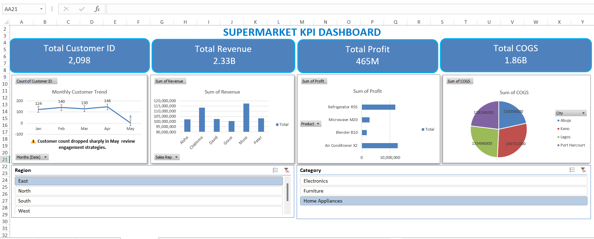

# supermarket-dashboard
Excel KPI Dashboard project analysing supermarket sales data with interactive slicers and visual insights.

# Supermarket KPI Dashboard
This project showcases the transformation of messy sales data into a clean, structured dataset. After cleaning, pivot tables were created to calculate key performance indicators (KPIs) such as Revenue, COGS, Profit, and Customer count. Finally, an interactive Excel dashboard was built to visualise these insights and highlight trends, including the drop in customer count during May.

Author: Hezekiah Usamah.

